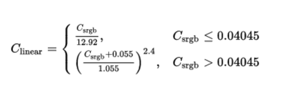
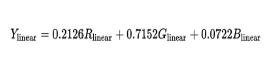
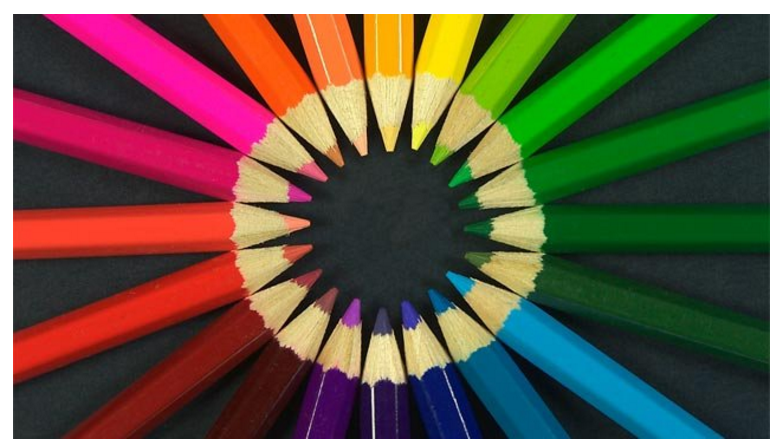
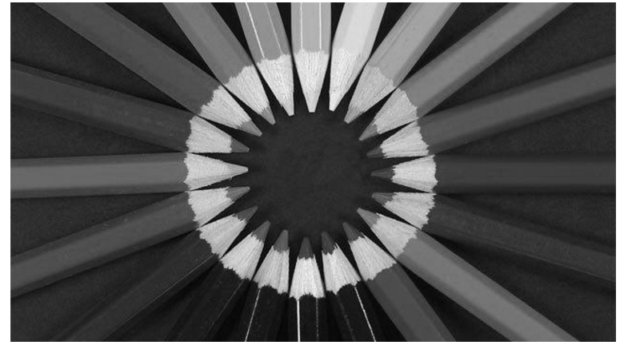

== Görüntü İşleme Ağırlık Toplama Yöntemi ile Renk Uzayı İşlemleri

== İçindekiler +
.İçindekiler +
. Versiyon Geçmişi +
. Giriş +
. Ağırlık toplama Yöntemi +
. Python ile Ağırlık Toplama Yöntemi Uygulaması +
. Referanslar +

== 1) *Versiyon Geçmişi* +

|===
|Tarih|Değişiklik|Kişi

|22.10.2016
| 

|Gönül TOKTAY
|25.10.2016

|
|Miraç Sıla GENÇ 
|===

|12.12.2016
|Düzenleme
|Merve Tafralı
|===

== 2) *Giriş* +

Görüntü işleme, genel olarak resimsel bilgilerin analizine yönelik bir yöntem olarak tanımlanabilir. Günlük yaşamda görüntü işlemenin en yaygın örneği gözlükler diyebiliriz. Numaralı gözlükler, gözlenen görüntüleri gözdeki bazı sapmalara göre değiştirip, görüntünün göz ile temasından önce görüntünün düzeltilmesi için görev görür. Görüntü işlemede amaç, orijinal şeklinde olmayan bir görüntüyü görsel olarak güçlendirmek ve istatistiksel olarak değerlendirmektir. Görüntü işleme algoritmaları olarak bilinen, görüntülerin iyileştirmesi veya değiştirilmesi için birçok görüntü işleme tekniği bulunmaktadır. +

Burada yapılacak olan çalışmanın ilk adımı olan görüntüyü griye çevirme işlemi anlatılacaktır. Görüntüyü griye çevirmek için kullanılacak olan görüntü işleme tekniği ‘Ağırlık Toplama Yönetimi’dir. Uygulamayı gerçekleştirebilmek için ağırlık toplama yönteminin ne olduğu, nasıl kullanıldığı  ve kullanım amaçlarından bahsedilecektir. +

== *Ağırlık toplama Yöntemi* +

*RGB* olarak tanımlanmış bir görüntüyü griye çevirme işleminde ağırlık metodu kullanılacaksa; R G B kanallarının kendine özgü ağırlıklarıyla uygulanacağı ifade edilmektedir. Sırasıyla R G ve B kanallarının ağırlıkları; 0.2126, 0.7152, 0.0722 şeklindedir. +

Ağırlık toplama yönteminin doğru uygulanabilmesinin ilk aşaması; RGB uzayında gama genleşmesi ve gama sıkıştırması fonksiyonlarının ortadan kaldırılması gerekir. Bu işlemin gerçekleştirilmesi için gerekli fonksiyon aşağıda tanımlanmıştır. +

İşlemin gerçekleştirilmesinden sonraki aşama ise doğrusal parlaklığın hesaplanmasıdır. Doğrusal parlaklık; üç doğrusal-yoğunluk değerlerinin ağırlıklı toplamı olarak hesaplanır. +

== 5) *Python ile Ağırlık Toplama Yöntemi Uygulaması*

Uygulamamızda renkli bir resmi gri tonlarına dönüştüreceğiz. Python dilinde resim dosyaları üzerinde işlem yapabilmek için “Image” kütüphanesini projemize dahil etmeliyiz. Python dili için bu tür grafik kütüphanelerini içine bulunduran “PIL” paketini indirebiliriz. Bunun için terminalimizden *“pip install pillow”* komutunu yazarak ‘PIL’ paketini indiriyoruz. Bu işlem bittikten sonra Eclipse->PyDev Project ile yeni projemize isim verip kodlarımızı yazmaya başlıyoruz. +

[[source,python]]
----
from PIL import Image                            # İlk olarak PIL paketinden Image kütüphanesini projemize dahil ediyoruz.

resim = Image.open("resim.jpg")                  # Kullanacağımız resmi ‘open’ fonksiyonu ile açıp ‘resim’ değişkenine atıyoruz.

yuklenen = resim.load()                          #’resim’ değişkeninde bulunan resmimizi ‘load’ fonksiyonu ile uygulamamıza yüklüyoruz ve ‘yuklenen’ değişkenine atıyoruz.

genislik=resim.size[0]                           #Resmin çözünürlüğünün genişlik boyutunu ‘genislik’ değişkenine atıyoruz.

yukseklik=resim.size[1]                          #Resmin çözünürlüğünün yükseklik boyutunu ‘yukseklik değişkenine atıyoruz.

for i in range(genislik):                        #Burada içiçe döngü kullanarak resmin çözünürlük değerleri ile bir matris oluşturduk. Böylece matris haline gelen her piksel üzerinde işlem yapılabilir.

  for j in range(yukseklik):
  
  r, g, b = resim.getpixel((i, j))               #Her pikselin renk değerini r,g,b, değişkenlerine atıyoruz. 
  
  gray=(int)((r*0.2126)+(g*0.7152)+(b*0.0722))   #Gri tonları r,g,b değişkenlerinden gelen renk değerlerine göre ayarlanarak gray değişkeni içerisine atılır.
  
  yuklenen[i,j]=(gray,gray,gray)                 #Her piksel için ayarlanan kırmızı,yeşil,mavi tonuna karşılık gelen gri tonu yine sırasıyla piksel piksel görüntüye işlenir.
  
resim.save("/Users/toktay/Desktop/yeni.jpg")     #Resim dosyamızı istenilen klasöre ‘save’ ile kaydediyoruz.

resim.show()                                     #Son olarak resmimizi görüntüleyebiliriz.

----

Bu uygulamada ekranda görüntü alabilmek için “resim.show()” metodu kullanılır. Bu metodun çalışabilmesi için bir görüntüleme programına ihtiyacınız vardır. İmagemagick programı ideal bir programdır. Bunu yüklemek için MacOs işletim sistemi için terminalimize *brew install imagemagick* yazarak bu programı indirebilirsiniz. +

== *Referanslar*
. http://stackoverflow.com/questions/23935840/converting-an-rgb-image-to-grayscale-and-manipulating-the-pixel-data-in-python
. http://stackoverflow.com/questions/12201577/how-can-i-convert-an-rgb-image-into-grayscale-in-python?noredirect=1&lq=1
